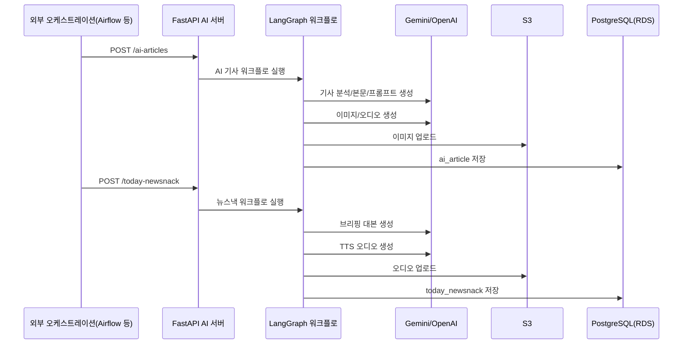

# 뉴스낵 AI 서버

뉴스낵의 AI 콘텐츠 생성을 담당하는 FastAPI 서버입니다. LangGraph 기반 워크플로로 AI 기사(웹툰/카드뉴스)와 오늘의 뉴스낵 브리핑을 자동 생성하며, 완성된 이미지와 오디오는 S3에, 메타데이터는 PostgreSQL(RDS)에 저장합니다.

## 주요 기능

- 외부 파이프라인에서 API 호출로 AI 기사/브리핑 생성
- 이슈별 AI 기사 생성(웹툰 또는 카드뉴스)
- 하루 2회 오늘의 뉴스낵(Top 5 오디오 브리핑) 자동 생성
- 멀티 프로바이더 지원: Google Gemini 기본, OpenAI로 전환 가능

## 기술 스택

[![FastAPI]][FastAPI url]
[![LangGraph]][LangGraph url]
[![LangChain]][LangChain url]
[![Google Gemini]][Google Gemini url]
[![OpenAI]][OpenAI url]
[![PostgreSQL]][PostgreSQL url]
[![AWS S3]][AWS S3 url]
[![Python]][Python url]

## 동작 방식

1. 외부 파이프라인(예: Airflow)이 이 서버의 API를 호출합니다.
2. AI 기사 생성 워크플로가 이슈 단위로 실행됩니다.
3. 뉴스낵 브리핑 워크플로는 하루 2회(아침/저녁) 자동 실행됩니다.
4. 생성된 미디어는 S3에 업로드되고, 메타데이터는 데이터베이스에 저장됩니다.

## 아키텍처



## 시스템 구성

- **API**: FastAPI를 통한 HTTP 인터페이스
- **워크플로**: LangGraph로 구현된 AI 기사/브리핑 생성 그래프
- **생성 노드**: 기사 분석 → 에디터 선택 → 본문 작성 → 이미지/오디오 생성 → DB 저장
- **저장소**: S3 미디어 저장소 + PostgreSQL 메타데이터
- **프로바이더**: 환경 변수로 Google Gemini/OpenAI 자유롭게 전환

## 호출 방식

이 서버의 핵심 역할은 외부 파이프라인의 요청을 받아 콘텐츠를 생성하는 것입니다. 뉴스 수집, 이슈 집계, 스케줄링은 모두 외부 시스템에서 수행하며, 다음의 두 엔드포인트로 호출됩니다.

- 이슈 단위 기사 생성: `POST /ai-articles`
- 오늘의 뉴스낵 생성: `POST /today-newsnack`

Swagger 문서는 <http://localhost:8000/docs> 에서 확인할 수 있습니다.

## 환경 변수

필수:
- `API_KEY`: 요청 헤더 `X-API-KEY` 검증용
- `DB_URL`: PostgreSQL 연결 문자열
- `AWS_REGION`, `AWS_S3_BUCKET`, `AWS_ACCESS_KEY_ID`, `AWS_SECRET_ACCESS_KEY`

AI 프로바이더:
- `AI_PROVIDER`: `google`(기본) 또는 `openai`
- `GOOGLE_API_KEY` (AI_PROVIDER=google일 때 필수)
- `OPENAI_API_KEY` (AI_PROVIDER=openai일 때 필수)

모델 설정(선택):
- `GOOGLE_CHAT_MODEL`, `OPENAI_CHAT_MODEL`
- `GOOGLE_IMAGE_MODEL`, `GOOGLE_IMAGE_MODEL_WITH_REFERENCE`, `OPENAI_IMAGE_MODEL`
- `GOOGLE_TTS_MODEL`, `OPENAI_TTS_MODEL`

## 로컬 실행

```bash
python -m venv .venv
source .venv/bin/activate
pip install -r requirements.txt
uvicorn app.main:app --reload
```

## 참고

- 프로바이더 전환: `AI_PROVIDER=openai`
- 참조 이미지 모드: `GOOGLE_IMAGE_WITH_REFERENCE=true`

<!-- MARKDOWN LINKS & IMAGES -->
[FastAPI]: https://img.shields.io/badge/FastAPI-009688?style=for-the-badge&logo=fastapi&logoColor=white
[FastAPI url]: https://fastapi.tiangolo.com/
[LangGraph]: https://img.shields.io/badge/LangGraph-1C3C3C?style=for-the-badge&logo=langchain&logoColor=white
[LangGraph url]: https://www.langchain.com/langgraph/
[LangChain]: https://img.shields.io/badge/langchain-1C3C3C?style=for-the-badge&logo=langchain&logoColor=white
[LangChain url]: https://www.langchain.com/
[Google Gemini]: https://img.shields.io/badge/Google%20Gemini-4285F4?style=for-the-badge&logo=google&logoColor=white
[Google Gemini url]: https://ai.google.dev/gemini-api/docs/
[OpenAI]: https://img.shields.io/badge/OpenAI-412991?style=for-the-badge&logo=openai&logoColor=white
[OpenAI url]: https://openai.com/
[PostgreSQL]: https://img.shields.io/badge/PostgreSQL-336791?style=for-the-badge&logo=postgresql&logoColor=white
[PostgreSQL url]: https://www.postgresql.org/
[AWS S3]: https://img.shields.io/badge/AWS%20S3-FF9900?style=for-the-badge&logo=amazon-s3&logoColor=white
[AWS S3 url]: https://aws.amazon.com/s3/
[Python]: https://img.shields.io/badge/Python-3776AB?style=for-the-badge&logo=python&logoColor=white
[Python url]: https://www.python.org/
