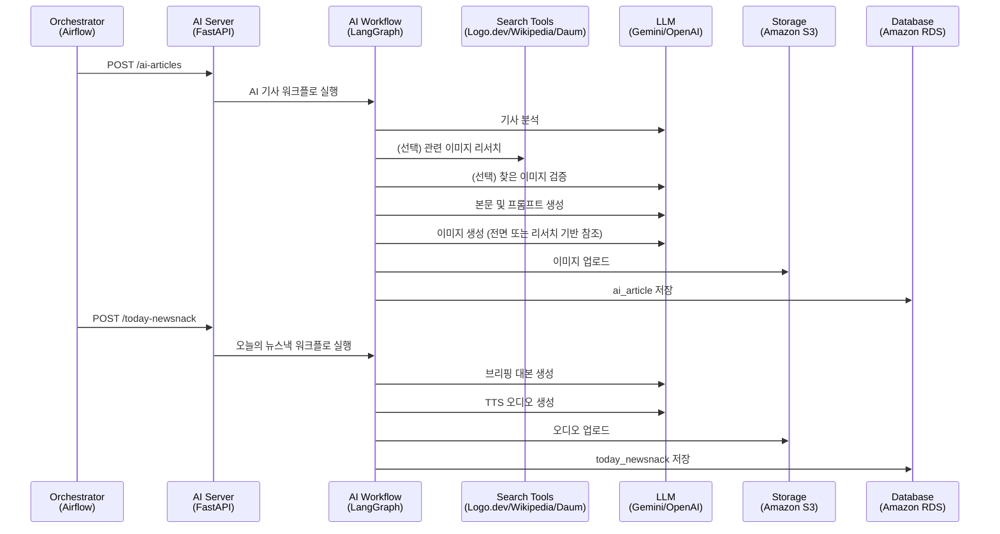
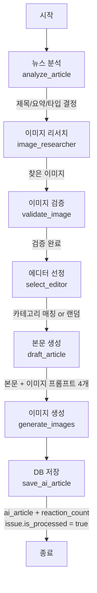
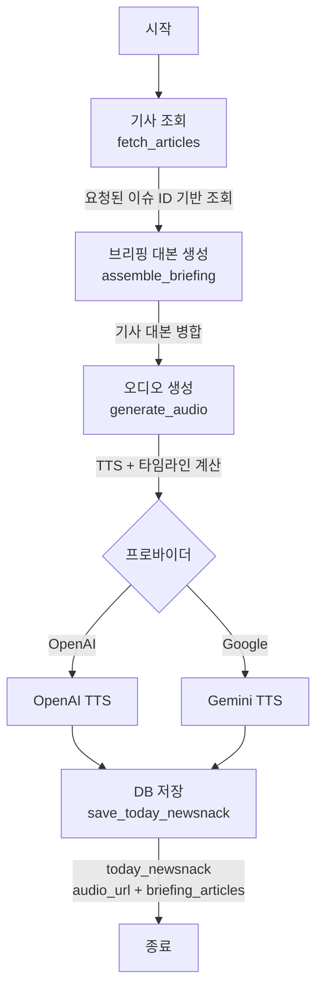

# 뉴스낵 AI 서버

뉴스낵의 AI 콘텐츠 생성을 담당하는 FastAPI 서버입니다. LangGraph 기반 워크플로로 AI 기사(웹툰/카드뉴스)와 오늘의 뉴스낵 브리핑을 자동 생성하며, 완성된 이미지와 오디오는 S3에, 메타데이터는 PostgreSQL(RDS)에 저장합니다.

## 주요 기능

- 외부 파이프라인에서 API 호출로 AI 기사/브리핑 생성
- 이슈별 AI 기사 생성(웹툰 또는 카드뉴스)
- 오늘의 뉴스낵(오디오 브리핑) 생성
- 멀티 프로바이더 지원: Google, OpenAI 사용 가능

## 기술 스택

[![FastAPI]][FastAPI url]
[![LangGraph]][LangGraph url]
[![LangChain]][LangChain url]
[![Google Gemini]][Google Gemini url]
[![OpenAI]][OpenAI url]
[![GitHub Actions]][GitHub Actions url]
[![Docker]][Docker url]
[![Amazon EC2]][Amazon EC2 url]
[![AWS S3]][AWS S3 url]
[![PostgreSQL]][PostgreSQL url]
[![Python]][Python url]

## 동작 방식

1. 외부 파이프라인(예: Airflow)이 이 서버의 API를 호출합니다.
2. AI 기사 생성 워크플로가 이슈 단위로 실행됩니다.
3. 뉴스낵 브리핑 워크플로는 하루 2회(아침/저녁) 자동 실행됩니다.
4. 생성된 미디어는 S3에 업로드되고, 메타데이터는 데이터베이스에 저장됩니다.

## 시스템 아키텍처

> 외부 시스템과 AI 서버의 관계



## 워크플로우

### AI 기사 생성 플로우

> LangGraph StateGraph로 구현된 이슈별 AI 기사 생성 워크플로



**주요 노드 설명:**
- `analyze_article`: 원본 기사 분석, 제목/요약 생성, 콘텐츠 타입(웹툰/카드뉴스) 결정
- `image_researcher`: 로고, 인물, 일반 이미지 등 기사 맥락에 맞는 요소 리서치 (Gemini 3 Pro Image 모델 사용 시)
- `validate_image`: 리서치된 이미지가 원본 기사에 적합한지 멀티모달 모델로 정밀 검증
- `select_editor`: 이슈의 카테고리와 일치하는 에디터 배정 (없으면 랜덤)
- `draft_article`: 에디터 페르소나 기반 본문 작성 및 이미지 프롬프트 4개 생성 (콘텐츠 타입에 따라 웹툰/카드뉴스 스타일 내부 분기)
- `generate_images`: 프로바이더 설정에 따라 최종 이미지 4장 생성
  - 컷 간 작화 유지를 위해 1장을 기준 이미지로 선 생성 후, 나머지 3장은 이를 **'스타일'로 참조**하여 병렬 생성
  - *참고: 만약 `image_researcher`에서 찾은 이미지(실사, 로고 등)가 있다면, 1장(기준) 생성 단계에서 이를 **'내용(Content)'으로 추가 참조**하여 기사 맥락을 반영함*
- `save_ai_article`: ai_article 테이블 저장, reaction_count 초기화, 이슈 처리 상태 업데이트

### 오늘의 뉴스낵 생성 플로우

> 외부에서 선정된 이슈 ID들을 받아 오디오 브리핑으로 생성



**주요 노드 설명:**
- `fetch_articles`: 요청받은 Issue ID 리스트에 해당하는 AI 기사들을 조회 (ID 순 정렬)
- `assemble_briefing`: 조회된 기사들을 구조화된 대본으로 변환 (기사 개수 유동적)
- `generate_audio`: 대본을 하나로 병합 후 TTS 생성, 오디오 길이 측정 및 타임라인 계산
- `save_today_newsnack`: S3 업로드 및 today_newsnack 테이블 저장

## 시스템 구성

- **API**: FastAPI를 통한 HTTP 인터페이스
- **워크플로**: LangGraph로 구현된 AI 기사/브리핑 생성 그래프
- **생성 노드**: 기사 분석 → 에디터 선택 → 본문 작성 → 이미지/오디오 생성 → DB 저장
- **저장소**: S3 미디어 저장소 + PostgreSQL 메타데이터
- **프로바이더**: 환경 변수로 Google Gemini/OpenAI 자유롭게 전환

## 호출 방식

이 서버의 핵심 역할은 외부 파이프라인의 요청을 받아 콘텐츠를 생성하는 것입니다. 뉴스 수집, 이슈 집계, 스케줄링은 모두 외부 시스템에서 수행하며, 다음의 두 엔드포인트로 호출됩니다.

- 이슈 단위 기사 생성: `POST /ai-articles`
- 오늘의 뉴스낵 생성: `POST /today-newsnack`

Swagger 문서는 <http://localhost:8000/docs> 에서 확인할 수 있습니다.

## 환경 변수

필수:
- `API_KEY`: 요청 헤더 `X-API-KEY` 검증용
- `DB_URL`: PostgreSQL 연결 문자열
- `AWS_REGION`, `AWS_S3_BUCKET`, `AWS_ACCESS_KEY_ID`, `AWS_SECRET_ACCESS_KEY`

AI 프로바이더:
- `AI_PROVIDER`: `google`(기본) 또는 `openai`
- `GOOGLE_API_KEY` (AI_PROVIDER=google일 때 필수)
- `OPENAI_API_KEY` (AI_PROVIDER=openai일 때 필수)

검색 도구 API (선택. 이미지 리서치 기능 사용 시):
- `LOGO_DEV_SECRET_KEY`, `LOGO_DEV_PUBLISHABLE_KEY`: 기업 로고 검색용 (Logo.dev)
- `KAKAO_REST_API_KEY`: 기존 도구 실패 시 이미지 검색용 (Daum)

모델 설정(선택):
- `GOOGLE_CHAT_MODEL`, `OPENAI_CHAT_MODEL`
- `GOOGLE_IMAGE_MODEL_PRIMARY`, `GOOGLE_IMAGE_MODEL_FALLBACK`, `OPENAI_IMAGE_MODEL`
- `GOOGLE_TTS_MODEL`, `OPENAI_TTS_MODEL`

## 로컬 실행

```bash
python -m venv .venv
source .venv/bin/activate
pip install -r requirements.txt
uvicorn app.main:app --reload
```

## 참고

- 프로바이더 전환: `AI_PROVIDER=openai`

<!-- MARKDOWN LINKS & IMAGES -->
[FastAPI]: https://img.shields.io/badge/FastAPI-009688?style=for-the-badge&logo=fastapi&logoColor=white
[FastAPI url]: https://fastapi.tiangolo.com/
[LangGraph]: https://img.shields.io/badge/langgraph-1C3C3C?style=for-the-badge&logo=langgraph&logoColor=white
[LangGraph url]: https://www.langchain.com/langgraph/
[LangChain]: https://img.shields.io/badge/langchain-1C3C3C?style=for-the-badge&logo=langchain&logoColor=white
[LangChain url]: https://www.langchain.com/
[Google Gemini]: https://img.shields.io/badge/google%20gemini-8E75B2?style=for-the-badge&logo=googlegemini&logoColor=white
[Google Gemini url]: https://ai.google.dev/gemini-api/docs/
[OpenAI]: https://img.shields.io/badge/OpenAI-412991?style=for-the-badge&logo=openai&logoColor=white
[OpenAI url]: https://openai.com/
[GitHub Actions]: https://img.shields.io/badge/github%20actions-%232088FF.svg?style=for-the-badge&logo=githubactions&logoColor=white
[GitHub Actions url]: https://github.com/features/actions
[Docker]: https://img.shields.io/badge/docker-%232496ED.svg?style=for-the-badge&logo=docker&logoColor=white
[Docker url]: https://www.docker.com/
[Amazon EC2]: https://img.shields.io/badge/Amazon%20EC2-%23FF9900.svg?style=for-the-badge&logo=amazonec2&logoColor=white
[Amazon EC2 url]: https://aws.amazon.com/ec2/
[AWS S3]: https://img.shields.io/badge/AWS%20S3-FF9900?style=for-the-badge&logo=amazon-s3&logoColor=white
[AWS S3 url]: https://aws.amazon.com/s3/
[PostgreSQL]: https://img.shields.io/badge/PostgreSQL-336791?style=for-the-badge&logo=postgresql&logoColor=white
[PostgreSQL url]: https://www.postgresql.org/
[Python]: https://img.shields.io/badge/Python-3776AB?style=for-the-badge&logo=python&logoColor=white
[Python url]: https://www.python.org/
